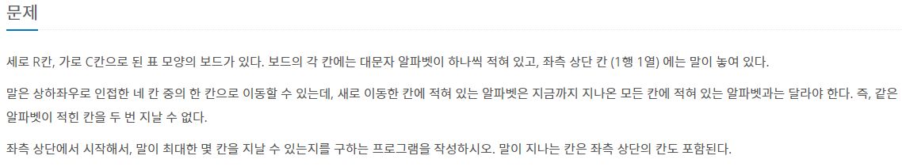

# 백준 알고리즘(DFS)

## 실패한 문제

#### [1987번. 알파벳](https://www.acmicpc.net/problem/1987)

[코드로 이동하기](https://github.com/yeomkyeorae/algorithm/blob/master/BJ/1987_alphabet.py)

> 실패한 이유?

- 재귀함수로 구현함에 따른 시간 초과

> 성공 전략

- ?

## 성공한 문제

