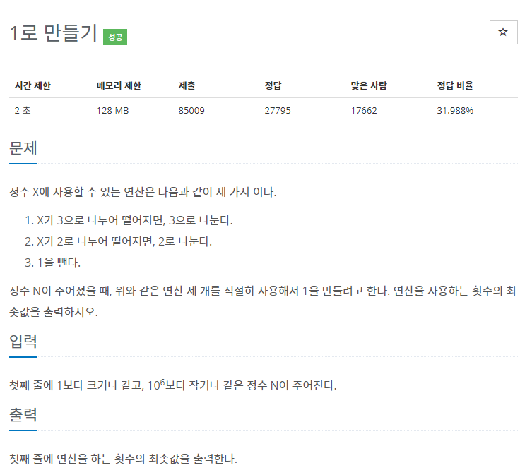
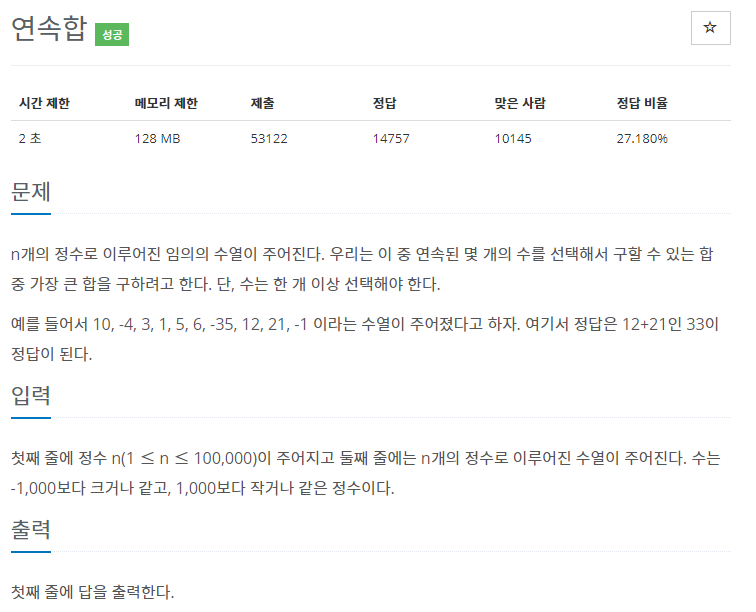
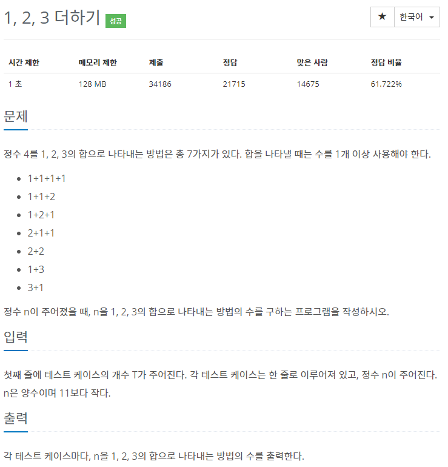
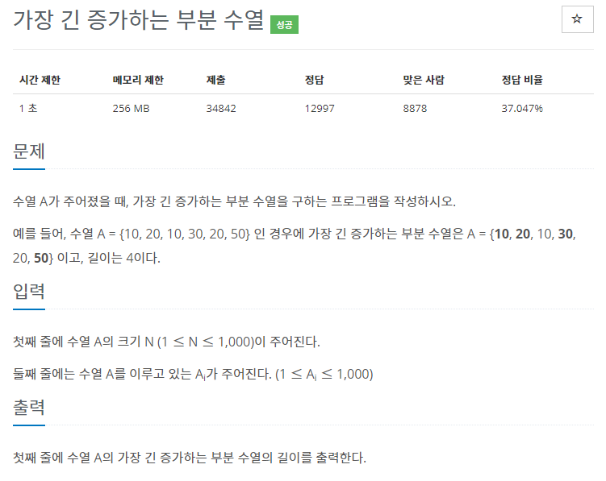
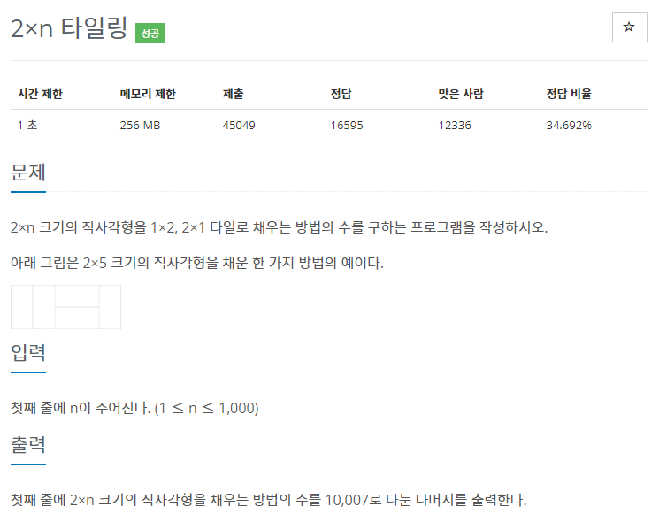
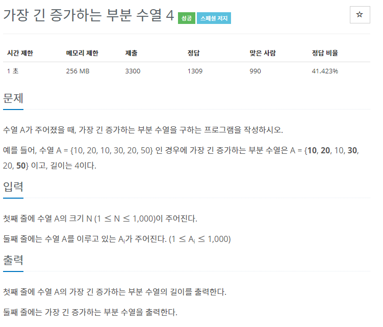

# 백준 알고리즘(DP, Dynamic Programming)

## 실패한 문제

## 성공한 문제

#### [1463번 1로 만들기](https://www.acmicpc.net/problem/1463)

[코드로 이동하기]()

> 전략

- ?

#### [1912번 연속합](https://www.acmicpc.net/problem/1912)

[코드로 이동하기]()

> 전략

- ?

#### [9095번 1, 2, 3 더하기](https://www.acmicpc.net/problem/9095)

[코드로 이동하기]()

> 전략

- ?

#### [11053번 가장 긴 증가하는 부분 수열](https://www.acmicpc.net/problem/11053)

[코드로 이동하기]()

> 전략

- ?

#### [11726번 2xn 타일링](https://www.acmicpc.net/problem/11725)

[코드로 이동하기]()

> 전략

- ?

#### [14002번 가장 긴 증가하는 부분 수열4](https://www.acmicpc.net/problem/14002)

[코드로 이동하기]()

> 전략

- ?