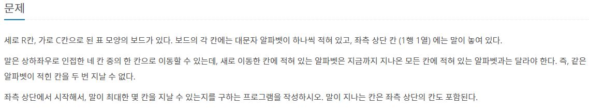
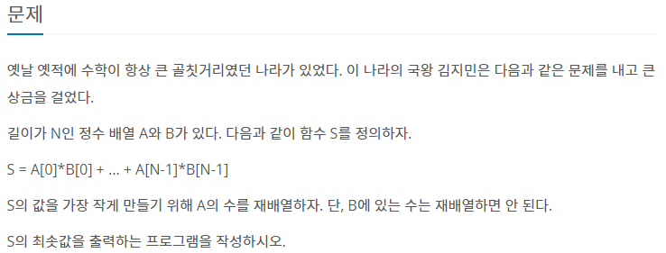

# 백준 알고리즘 

## 실패한 문제

#### [1987번. 알파벳](https://www.acmicpc.net/problem/1987)

[코드로 이동하기](https://github.com/yeomkyeorae/algorithm/blob/master/BJ/1987_alphabet.py)

> 실패한 이유?

- 재귀함수로 구현함에 따른 시간 초과

> 성공 전략

- ?

## 성공한 문제

#### [1026.번 보물](https://www.acmicpc.net/problem/1026)

[코드로 이동하기](https://github.com/yeomkyeorae/algorithm/blob/master/BJ/1026_treasure.py)

> 성공 전략

- S의 최솟값을 구하기 위한 전략으로, 한 배열은 오름차순으로 다른 배열은 내림차순으로 정렬해 작은 값과 큰 값이 곱해지도록 함.

