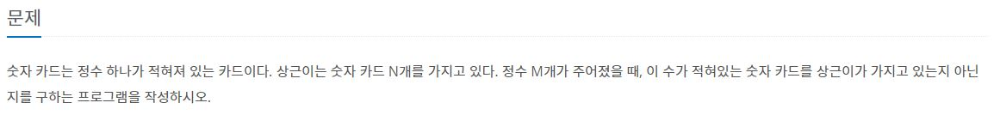

# 백준 알고리즘(sort)

## 실패한 문제

## 성공한 문제

#### [1026번 보물](https://www.acmicpc.net/problem/1026)

[코드로 이동하기](https://github.com/yeomkyeorae/algorithm/blob/master/BJ/sort/1026_treasure.py)

> 성공 전략

- S의 최솟값을 구하기 위한 전략으로, 한 배열은 오름차순으로 다른 배열은 내림차순으로 정렬해 작은 값과 큰 값이 곱해지도록 함.

#### [1427번 소트인사이드](https://www.acmicpc.net/problem/1427)

[코드로 이동하기](https://github.com/yeomkyeorae/algorithm/blob/master/BJ/sort/1427_sort_inside.py)

> 성공 전략

- 여러 자릿수를 한 자리씩 끊어 리스트로 저장 후 정렬.

#### [1181번 단어 정렬](https://www.acmicpc.net/problem/1181)

[코드로 이동하기](https://github.com/yeomkyeorae/algorithm/blob/master/BJ/sort/1181_word_sort.py)

> 성공 전략

- 딕셔너리에 key에 단어의 길이, value에 단어를 저장.
- 딕셔너리의 key를 오름차순으로 정렬해 순차적으로 key에 따른 value(list 형식)에 접근
- value는 정렬하여 순차적으로 출력.

#### [10814번 나이순 정렬](https://www.acmicpc.net/problem/10814)

[코드로 이동하기](https://github.com/yeomkyeorae/algorithm/blob/master/BJ/sort/10814_order_by_age.py)

> 성공 전략

- 회원의 나이와 이름을 각각 key와 value로 구성된 `dictionary`를 구성함. 딕셔너리를 활용한 이유는 value에 이름을 순차적으로 추가함으로써 회원들이 가입한 순서를 알기 위해서임.
- 동시에 나이를 저장하는 `set` 를 구성해 어린 순서부터 출력하기 위한 베이스를 구성.

#### [11651번 좌표 정렬하기2](https://www.acmicpc.net/problem/11651)

[코드로 이동하기](https://github.com/yeomkyeorae/algorithm/blob/master/BJ/sort/11651_sort_coor2.py)

> 성공 전략

- 위 두 문제와 마찬가지로 `dictionary`를 활용해서 문제를 해결하였다.
- 시간이 많이 걸리는 점을 빌어서 다른 해결 방안을 구상할 필요가 있다.

#### [10815번 숫자 카드](https://www.acmicpc.net/problem/10815)

[코드로 이동하기]()

> 전략

- 문제에서 가질 수 있는 숫자의 범위가 넓으므로 이진 탐색으로 접근해야 함을 인지.
- 이진 탐색으로 실행하기 위해서는 정렬이 조건시 되므로 파이썬 내장 sort(아마도 퀵 소트)를 활용함.