# <SWEA 알고리즘> - D2

# 실패한 문제 & 진행중인 문제

#### 가랏! RC카!

[코드로 이동하기](https://github.com/yeomkyeorae/algorithm/blob/master/SWEA/D2/unfinished/D2_go_rc_car.py)

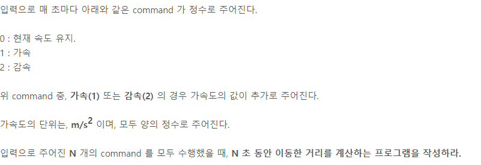

# 성공한 문제

#### 중간 평균값 구하기

[코드로 이동하기](https://github.com/yeomkyeorae/algorithm/blob/master/SWEA/D2_mid_mean_value.py)

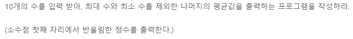

> 성공 전략

- 문제를 정확히 파악하였음.
- round 함수를 통해 반올림을 실시.

#### 조교의 성적 매기기

[코드로 이동하기](https://github.com/yeomkyeorae/algorithm/blob/master/SWEA/D2_assist_grading.py)

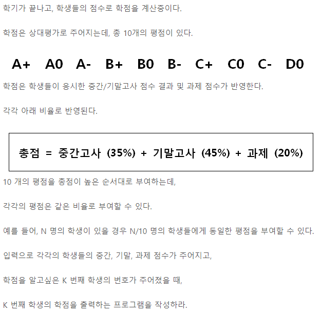

> 성공 전략

- 먼저 K 번째 학생의 등수를 파악하고자 함.
- 그리고 그 등수를 바탕으로 그 학생의 학점이 무엇인지 알아내고자 함. 
- 학생의 수가 10의 배수이기 때문에 각 학점이 부여되는 횟수가 동일하다는 점에 착안해 학생 수에 따른 학점 부요 횟수의 규칙성을 파악함.

#### 스도쿠검증

[코드로 이동하기](https://github.com/yeomkyeorae/algorithm/blob/master/SWEA/D2_sdoku_checking.py)

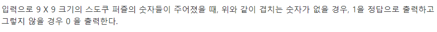

> 성공 전략

- row 방향, col 방향, square 형태의 총 3가지를 검증하고자 함.
- 따라서, 수도쿠를 입력 받자마자 위 3가지 형태를 저장하는 각각의 리스트를 생성함.
- 위에서 생성한 리스트를 바탕으로 검증.

> 발전

- 리스트로 저장하지 않고 메모리를 절약하면서 바로 검증할 수도 있을 거 같다.
- 수도쿠의 규칙성에 의거하여 위 3가지 형태를 고려하지 않고도 검증할 수 있지 않을까?

#### 시각 덧셈

[코드로 이동하기](https://github.com/yeomkyeorae/algorithm/blob/master/SWEA/D2_add_time.py)

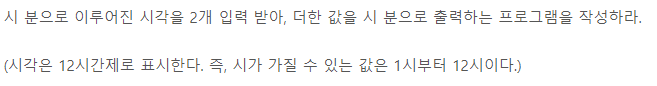

> 성공 전략

- 분을 더했을 때 60이 넘으면 시간을 더하고
- 시간을 더했을 때 12가 넘으면 1~12 사이 단위로 변환

#### 지그재그숫자

[코드로 이동하기](https://github.com/yeomkyeorae/algorithm/blob/master/SWEA/D2_zigzag.py)

> 성공전략

- `list comprehension`을 적절히 활용하였다. 짱짱

#### 초심자의 회문 검사

[코드로 이동하기](https://github.com/yeomkyeorae/algorithm/blob/master/SWEA/D2_palindrome_checking.py)

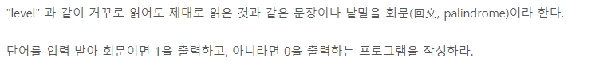

> 성공전략

- `str`객체를 거꾸로 만들기 위해서 string[ : : -1]과 같이 접근하였다.
- `list comprehension`!

#### 어디에 단어가 들어갈 수 있을까

[코드로 이동하기](https://github.com/yeomkyeorae/algorithm/blob/master/SWEA/D2_can_word_be_in.py)

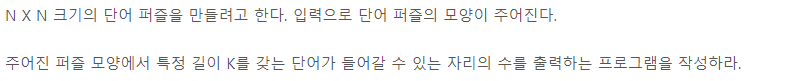

> 성공전략

- 전체 탐색하면서 0을 만나면 `is_possible`를 0으로 초기화하고, 1을 만나면 `is_possible`값을 +1한다.
- 0을 만나고 is_possible 값을 확인했을 때 특정 길이 K이면 개수에 +1한다. 

#### 쉬운 거스름돈

[코드로 이동하기](https://github.com/yeomkyeorae/algorithm/blob/master/SWEA/D2_easy_changes.py)

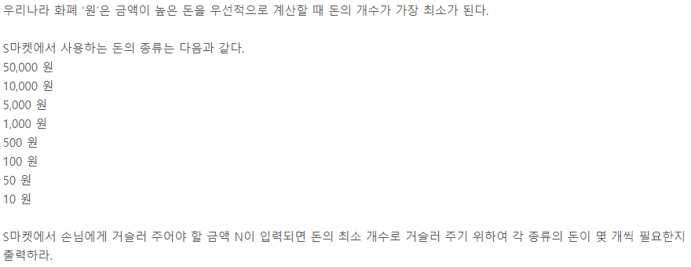

> 성공전략

- 큰 단위의 금액부터 잔돈을 지급하면서 나머지를 다음 단위 금액으로 지급하는 식으로 접근

>유의할 점

- 위의 전략이 통하지 않는 경우가 있음을 인지.

  

#### 숫자 배열 회전

[코드로 이동하기](https://github.com/yeomkyeorae/algorithm/blob/master/SWEA/D2_num_array_rotation.py)

> 성공전략

- 90도 반시계 방향으로 회전했을 때 첫 번째 행이 마지막 열이 되고, 두 번째 행이 마지막에서 왼쪽 열이 됨을 인지.
- 180도는 90도 회전한 거 에서 다시 90도 회전을 해 구함. 270도도 마찬가지

#### 숫자를 정렬하자

[코드로 이동하기](https://github.com/yeomkyeorae/algorithm/blob/master/SWEA/D2_sort_num.py)

> 성공전략

- 오름차순으로 정렬하기 위해 리스트에서 최솟값을 뽑아내고 다른 임시 리스트에 저장하는 방식으로 사용

#### 두 개의 숫자열

[코드로 이동하기](https://github.com/yeomkyeorae/algorithm/blob/master/SWEA/D2_two_num_lists.py)

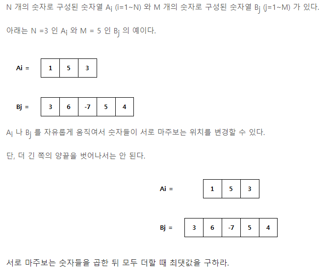

> 성공전략

- 작은 크기의 리스트를 기준으로, 그 리스트의 각 요소들을 큰 크기의 리스트 값과 곱해 새로운 리스트를 생성함. 예를 들면 위의 Ai에서 1값이 아래 Bj의 3, 6, -7과 곱한 값을 저장하는 식임. 
- 위와 같은 방식을 이용하면 [[1이 곱한 값], [5가 곱한 값], [3이 곱한 값]]을 저장할 수 있음.
- 일정 방향으로의 인덱스를 활용해 합을 구하고, 최대값을 출력함.

#### 달팽이 숫자

[코드로 이동하기](https://github.com/yeomkyeorae/algorithm/blob/master/SWEA/D2/D2_snail_number.py)

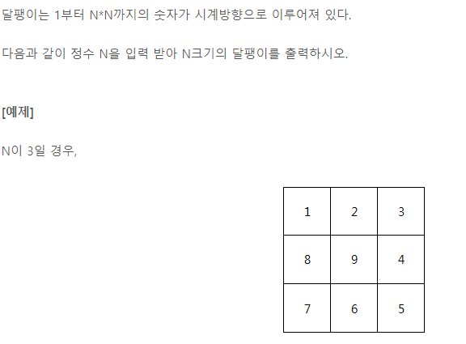

> 성공전략

- (0, 0)에서 시작해 반시계 방향으로(오른쪽 -> 아래 -> 왼쪽 -> 위) 계속 이동하는 규칙성에 의거.
- 반시계 방향으로 이동하면서 그 반경은 지속적으로 감소하는 것에 착안.
- 위의 경우 오른쪽으로 3, 아래로 2(3-1), 왼쪽으로 2(3-1), 위로 1(2-1) 변화하는 것을 인지.
- 또한, 오른쪽이나 왼쪽으로 이동할 때는 row index가 고정되고, 위나 아래로 이동할 때는 col index가 고정되는 것을 반영.

> 개선방향

- 분명히 더 나은 방법이 있을텐데 ... 너무 노가다로 풀었다.

#### 날짜 계산기

[코드로 이동하기](https://github.com/yeomkyeorae/algorithm/blob/master/SWEA/D2/D2_date_calc.py)

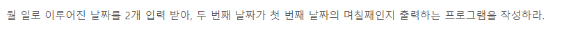

> 성공전략

- 미리 각 월에 해당하는 일 수를 리스트로 저장
- 두 날짜가 월이 같을 경우 두 월의 일수의 차만 구함
- 두 날짜가 월이 다를 경우 빠른 월의 (최대 일수 - 현재 일)을 구함.

#### 간단한 압축 풀기

[코드로 이동하기](https://github.com/yeomkyeorae/algorithm/blob/master/SWEA/D2/D2_easy_decompress.py)

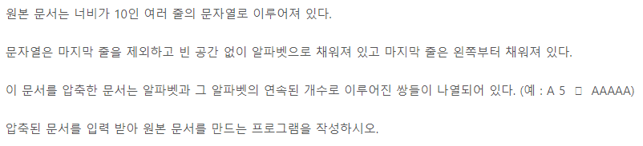

> 성공전략

- 딕셔너리를 구성해 key에 문자 value에 문자가 나온 횟수를 미리 저장
- 딕셔너리 정보를 바탕으로 전체 리스트를 구성
- 열개씩 끊어 한 줄에 출력

> 개선방향

- 굳이 딕셔너리를 사용하지 않고도 전체 리스트를 구성할 수 있을 것 같다.

#### 간단한 소인수분해

[코드로 이동하기](https://github.com/yeomkyeorae/algorithm/blob/master/SWEA/D2/D2_easy_factorization.py)

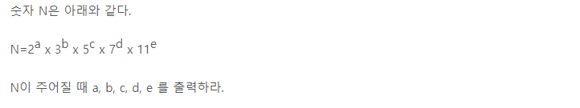

> 성공전략

- `딕셔너리`를 구성해 `key에 소수` `value에 그 소수가 등장한 횟수`를 저장
- 2, 3, 5, 7, 11 나눠서 0을 경우 나머지가 0이면 해당 소수의 key를 갖는 dict의 value를 1 증가

#### 새로운 불면증 치료법

[코드로 이동하기](https://github.com/yeomkyeorae/algorithm/blob/master/SWEA/D2/D2_new_insomnia_remedy.py)

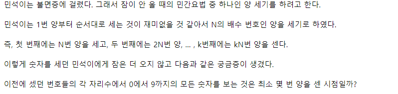

> 성공 전략

- set을 구성해 민석이가 해당 숫자를 세었으면 추가하는 형식으로 사용. set 길이가 10이면 종료하고 그 횟수를 출력하도록 함.

#### 아름이의 돌 던지기

[코드로 이동하기](https://github.com/yeomkyeorae/algorithm/blob/master/SWEA/D2/D2_areum_rock_throwing.py)

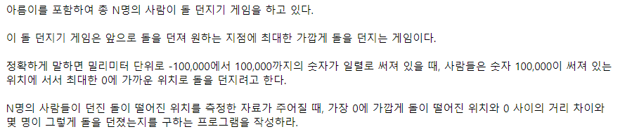

> 성공 전략

- 각각 던진 돌이 0으로부터 떨어진 값을 구하기 위해 list comprehension으로 절대값을 취함.
- 리스트로 구성된 값들 중에서 min값을 구하고 count로 그 개수를 구함.

#### 수도 요금 경쟁

[코드로 이동하기](https://github.com/yeomkyeorae/algorithm/blob/master/SWEA/D2/D2_water_fare_compete.py)

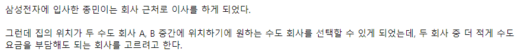

> 성공 전략

- 문제에서 제시하는 변수들을 잘 이해한다.

#### [S/W 문제해결 기본] 1일차 - 최빈수 구하기

[코드로 이동하기](https://github.com/yeomkyeorae/algorithm/blob/master/SWEA/D2/D2_1day_mode.py)

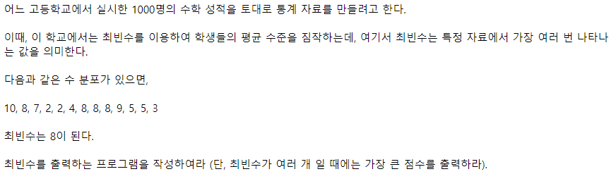

> 성공 전략

- Dict를 활용해서 key에 숫자 value에 그 숫자가 나온 횟수를 저장함.

#### 5174. Subtree

[코드로 이동하기]()

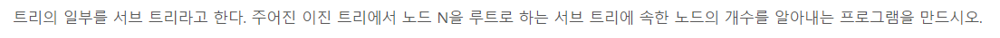

> 전략

- N을 시작점으로, 중위순회(inorder)하여 개수를 세어나감.

#### 5176. 이진 탐색

[코드로 이동하기]()

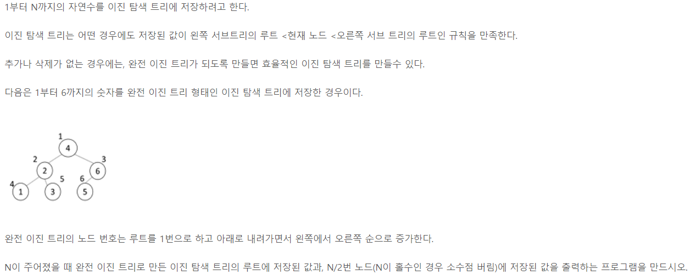

> 전략

- 위의 그림에서 노드 값의 순서가 중위순회를 한다는 점에 착안
- 루트가 index 1이므로 이를 기준으로 중위순회를 함. 왼쪽 자식의 index는 * 2, 오른쪽 자식의 index는 * 2 + 1.
- Recursion을 활용.

#### 5177. 이진 힙

[코드로 이동하기]()

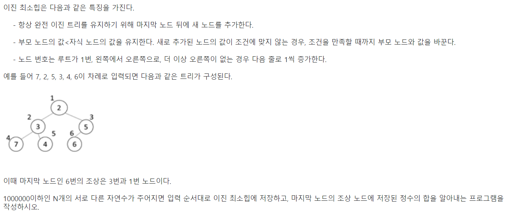

> 전략

- Heap을 구성하기 위해 push 함수를 구현함.
- 마지막 input이 마지막 노드인 보장이 없으므로, push 함수 내에서 input으로 들어가게 된 마지막 노드의 값이 더 작아 최초 교환될 때 피교환되는 값을 마지막 노드로 정의함.