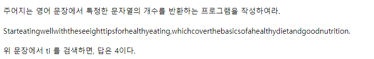
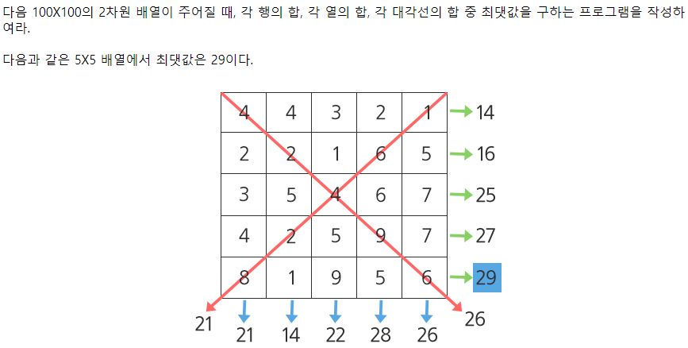
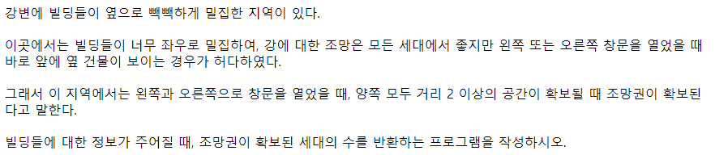
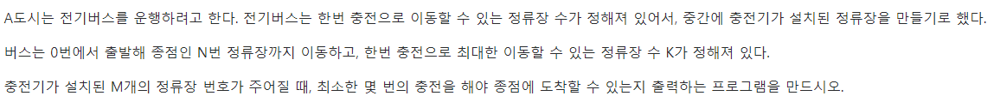

# <SWEA 알고리즘> - D3

# 실패한 문제 & 진행중인 문제

[코드로 이동하기]()

# 성공한 문제

#### [S/W 문제해결 기본] 3일차 - String

[코드로 이동하기](https://github.com/yeomkyeorae/algorithm/blob/master/SWEA/D3/D3_3day_String.py)

> 성공 전략

- Python Str type 객체에서 지원하는 count를 사용해 쉽게 해결.

#### [S/W 문제해결 기본] 2일차 - Sum

[코드로 이동하기](https://github.com/yeomkyeorae/algorithm/blob/master/SWEA/D3/D3_2day_Sum.py)

> 성공 전략

- 입력을 받을 때 2차원 형태의 배열로 리스트를 구성함.
- 가로, 세로, 우하향 대각선, 좌하향 대각선의 합들을 하나의 리스트로 구성함.
- 위에서 구한 리스트에서 최댓값을 구함.

#### [S/W 문제해결 기본] 1일차 - View

[코드로 이동하기](https://github.com/yeomkyeorae/algorithm/blob/master/SWEA/D3/D3_1day_View.py)

> 성공 전략

- 현재 빌딩에서 좌측 2 범위 안에서의 최대 크기의 빌딩을 찾는다.
- 현재 빌딩에서 우측 2 범위 안에서의 최대 크기의 빌딩을 찾는다.
- 위에서 구한 빌딩 내에서 최대 크기의 빌딩을 찾는다.
- (현재 빌딩 - 위에서 구한 최대 크기의 빌딩)가 0보다 크면 결과 값에 추가한다. 

#### 4831. 전기버스

[코드로 이동하기](https://github.com/yeomkyeorae/algorithm/blob/master/SWEA/D3/D3_1day_elec_bus.py)

> 성공 전략

- 먼저 충전소가 설치된 정류장 사이의 거리가 연비 이내에 있는지 확인.
- 모두 연비 이내에 있는 것이 확인되면 그리디 형식으로 접근. 현재 위치에서 가장 먼 곳에 있는 정류장을 선택해 나가는 형식.

