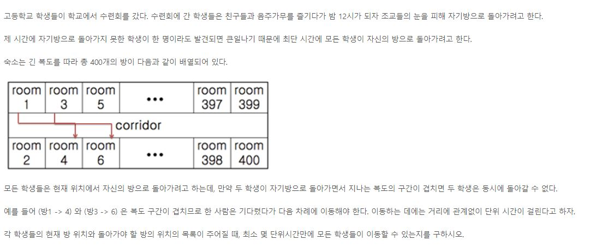

# <SWEA 알고리즘> - D4

# 실패한 문제 & 진행중인 문제

#### 4408. 자기 방으로 돌아가기

[코드로 이동하기]()

> 전략

- 처음 시도한 전략은 입력이 들어올 때마다 겹치지 않는 그룹이 있으면 그 그룹에 포함해 전체 그룹의 개수를 세는 형태이다.
- sample input로는 전부 정답이었지만, 코드를 제출했을 때 반 정도 정답인 것을 확인. 하지만 정확한 오류를 잡아내지 못함.
- 문제를 푸는 시간이 2시간이 초과하여 다른 사람의 코드를 참조함.
- 참조한 코드는 리스트를 생성하여 어느 한 경로가 리스트 인덱스에 해당하면 1을 추가하는 형식을 사용.
- 리스트 내에서 가장 높은 값을 갖는 것이 정답임을 확인할 수 있었음.

# 성공한 문제

#### 1238번 Contact

[코드로 이동하기]()

> 전략

- `BFS`를 활용

#### 1861번 정사각형 방

[코드로 이동하기]()

> 전략

- 상하좌우에 대해서 재귀를 적용
- 현재 방 번호보다 1이 큰 방에 방문할 수 있으므로, 작은 방 번호부터 고려해야 방문할 수 있는 방의 개수를 최대로 구할 수 있을거라 생각함. 예를 들어 1에서 9까지의 방 번호가 있고, 1에서 9까지 방문할 수 있다면, 1에서 시작해야 곧장 1부터 9까지의 최대 방문 개수를 구할 수 있지만, 4부터 방문한다면 4에서 9까지의 방문 개수 밖에 구하지 못한다고 생각.
- 재귀를 하는 도중에 방문한 방이 있다면 가지치기함.
- 위의 아이디어로 정답을 도출함에도 불구하고 다른 사람들의 코드보다 긴 실행시간을 기록함.
- 보완의 필요성이 있음. 