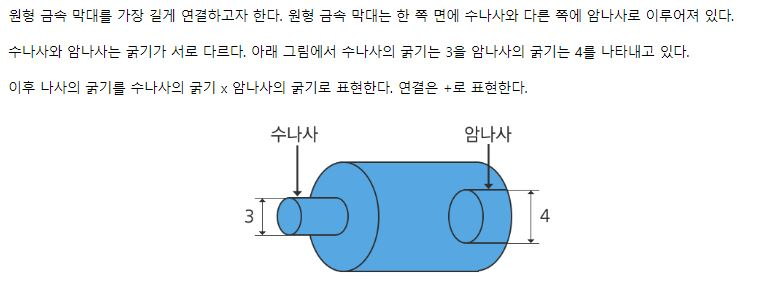

# <SWEA 알고리즘> - D5

# 실패한 문제 & 진행중인 문제

[코드로 이동하기]()

# 성공한 문제

#### [S/W 문제해결 응용] 7일차 - 금속막대

[코드로 이동하기](https://github.com/yeomkyeorae/algorithm/blob/master/SWEA/D3/D3_3day_String.py)

> 전략

- 처음에 백트래킹 방식으로 문제를 해결해야하는지 알고 머리를 싸매고 고민.
- 이 문제는 모든 나사들이 가정돼 있기 때문에 쉽게 해결되어야 할 문제였음.
- 2차원 리스트 대신 딕셔너리를 구성해서 문제를 해결함. key로 접근해서 value를 key로 해당해서 계속 딕셔너리로 타고 들어가는 형태임.
- 좋은 문제는 아닌 거 같음. 제약 사항이 자세히 명시돼 있고, 백트래킹으로 문제를 풀도록 구성돼 있으면 좋은 문제가 될 수 있을 거라고 생각함.

