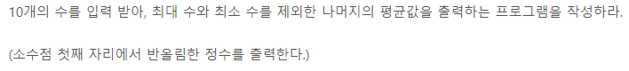
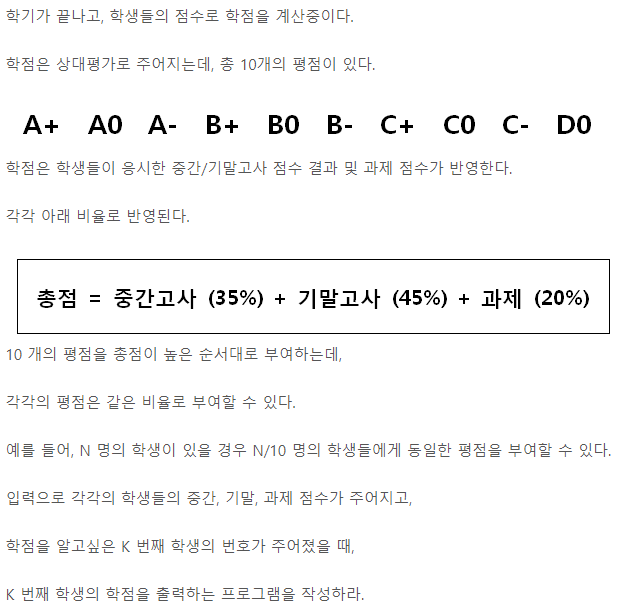
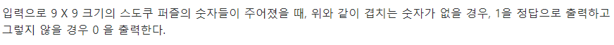
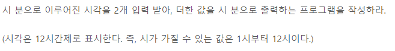
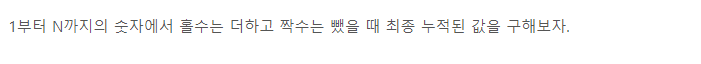
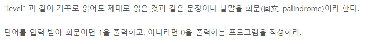

# <SWEA 알고리즘> 

# 실패한 문제

# 성공한 문제

## D2

#### 중간 평균값 구하기

[코드로 이동하기](https://github.com/yeomkyeorae/algorithm/blob/master/SWEA/D2_mid_mean_value.py)

> 성공 전략

- 문제를 정확히 파악하였음.
- round 함수를 통해 반올림을 실시.

#### 조교의 성적 매기기

[코드로 이동하기](https://github.com/yeomkyeorae/algorithm/blob/master/SWEA/D2_assist_grading.py)

> 성공 전략

- 먼저 K 번째 학생의 등수를 파악하고자 함.
- 그리고 그 등수를 바탕으로 그 학생의 학점이 무엇인지 알아내고자 함. 
- 학생의 수가 10의 배수이기 때문에 각 학점이 부여되는 횟수가 동일하다는 점에 착안해 학생 수에 따른 학점 부요 횟수의 규칙성을 파악함.

#### 스도쿠검증

[코드로 이동하기](https://github.com/yeomkyeorae/algorithm/blob/master/SWEA/D2_sdoku_checking.py)

> 성공 전략

- row 방향, col 방향, square 형태의 총 3가지를 검증하고자 함.
- 따라서, 수도쿠를 입력 받자마자 위 3가지 형태를 저장하는 각각의 리스트를 생성함.
- 위에서 생성한 리스트를 바탕으로 검증.

> 발전

- 리스트로 저장하지 않고 메모리를 절약하면서 바로 검증할 수도 있을 거 같다.
- 수도쿠의 규칙성에 의거하여 위 3가지 형태를 고려하지 않고도 검증할 수 있지 않을까?

#### 시각 덧셈

[코드로 이동하기](https://github.com/yeomkyeorae/algorithm/blob/master/SWEA/D2_add_time.py)

> 성공 전략

- 분을 더했을 때 60이 넘으면 시간을 더하고
- 시간을 더했을 때 12가 넘으면 1~12 사이 단위로 변환

#### 지그재그숫자

[코드로 이동하기](https://github.com/yeomkyeorae/algorithm/blob/master/SWEA/D2_zigzag.py)

> 성공전략

- `list comprehension`을 적절히 활용하였다. 짱짱

#### 초심자의 회문 검사

[코드로 이동하기](https://github.com/yeomkyeorae/algorithm/blob/master/SWEA/D2_palindrome_checking.py)

> 성공전략

- `str`객체를 거꾸로 만들기 위해서 string[ : : -1]과 같이 접근하였다.
- `list comprehension`!

